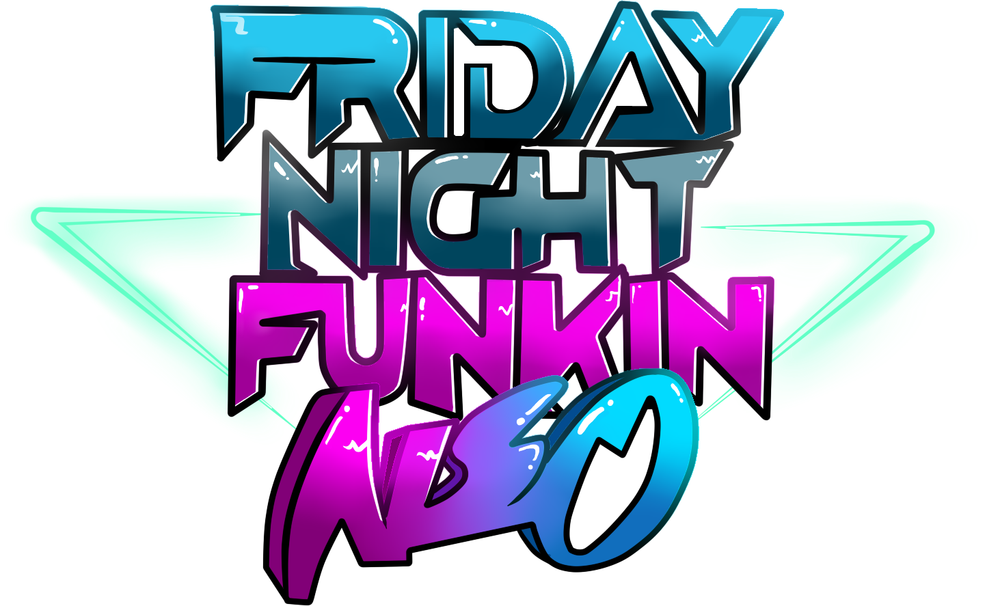

	 

# Friday Night Funkin': Neo V3
## About
FNF: Neo V3 is a ambitious game modification based around the remixes by JellyFish

## Credits
### Main Team

- JellyFish! - Director / Musician / Charter
- Moisty - Co-Director / Lead Artist and Designer
- Smokey - Coding
- GenoX - Coding / Charting / Minor art assets
- NoLime - Backgrounds / Animation / Sprite Cleanup
- Pincer - Animation / Art  / Sprite Cleanup
- Tamacoochi - Story / Dialogue 
- Twoop - Cutscenes / Minor art assets
- BrightFyre - Coding

### Helpers

- ARTISTGMER - Skid and Pump Design / Other Design Inspiration
- SimplyCrispy - Illusion Instrumental Help
- Biddle3 - MILF Revamp
- RecD - Monster Lyrics / Voice Acting
- NateAnim8 - Monster Singer
- KatChii - Dialogue Help
- BombasticHype - Health Bar Icons
- KadeDev - Kade Engine
- Sock.wav - Allowing the usage of whitty in lore
- CesarFever - Being cesar
- EvanClubYT - Animation Help
- JakeNeutron - Trailer Animations
- Bina - GF Voice
- Dazuko - Revamp Help
- ArtCarrot - Promo Art
- MashProTato - Crowd Assets
- Klutch - Charting 
- RamenNoodiles - Design Inspiration
- Clowfoe - @Clowfoe
- BBPanzu - Helped fix pico vocals
- UniqueGeese - Free eggs
- Monday Dusk Monolith - Lemon demon design

# Installation
1. [Install Haxe 4.1.5](https://haxe.org/download/version/4.1.5/). You should use 4.1.5 instead of the latest version because the latest version has some problems with Friday Night Funkin': Kade Engine.
2. After installing Haxe, [Install HaxeFlixel](https://haxeflixel.com/documentation/install-haxeflixel/).
3. Install `git`.
	- Windows: install from the [git-scm](https://git-scm.com/downloads) website.
	- Linux: install the `git` package: `sudo apt install git` (ubuntu), `sudo pacman -S git` (arch), etc... (you probably already have it)
4. Install and set up the necessary libraries:
	- `haxelib install lime 7.9.0`
	- `haxelib install openfl`
	- `haxelib install flixel`
	- `haxelib run lime setup`
	- `haxelib run lime setup flixel`
	- `haxelib install flixel-tools`
	- `haxelib run flixel-tools setup`
	- `haxelib install flixel-addons`
	- `haxelib install flixel-ui`
	- `haxelib install hscript`
	- `haxelib install newgrounds`
	- `haxelib install linc_luajit`
	- `haxelib git discord_rpc https://github.com/Aidan63/linc_discord-rpc`

# Credits
### Friday Night Funkin'
 - [ninjamuffin99](https://twitter.com/ninja_muffin99) - Programming
 - [PhantomArcade3K](https://twitter.com/phantomarcade3k) and [Evilsk8r](https://twitter.com/evilsk8r) - Art
 - [Kawai Sprite](https://twitter.com/kawaisprite) - Music

This game was made with love to Newgrounds and its community. Extra love to Tom Fulp.
### Kade Engine
- [KadeDeveloper](https://twitter.com/KadeDeveloper) - Maintainer and lead programmer
- [The contributors](https://github.com/KadeDev/Kade-Engine/graphs/contributors)

### Shoutouts
- [GWebDev](https://github.com/GrowtopiaFli) - Video Code
- [PolybiusProxy](https://github.com/polybiusproxy) - Video Code & Polymod Support
- [Rozebud](https://github.com/ThatRozebudDude) - Ideas (that I stole)
- [Puyo](https://github.com/daniel11420) - Setting up appveyor and a lot of other help